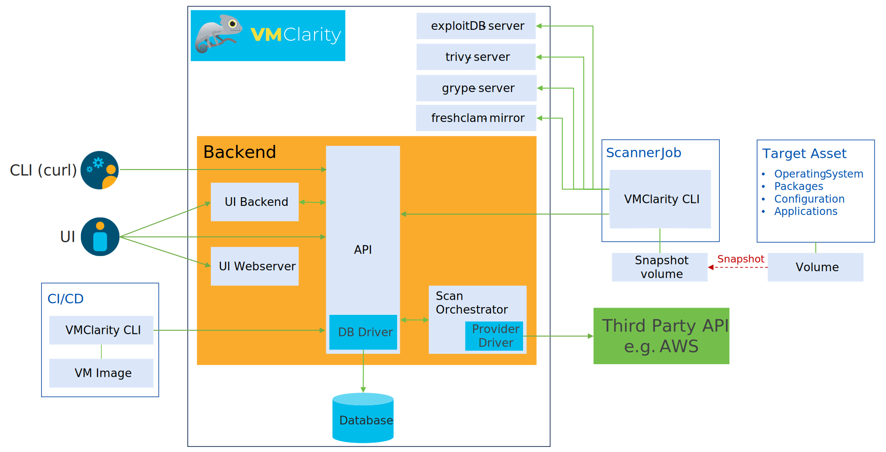

# High Level Architecture

Today, VMClarity has two halves, the VMClarity infrastructure, and the VMClarity CLI.

The VMClarity infrastructure includes:

- **Backend**: The core component of VMClarity. Within this service there are
  sub-components (it is in the roadmap to break these into dedicated microservices):

    - **API**: The VMClarity API for managing all objects in the VMClarity
      system. This is the only component in the system which talks to the DB.

    - **Orchestrator**: Orchestrates and manages the life cycle of VMClarity scan
      configs, scans and asset scans. Within the Orchestrator there is a
      pluggable "provider" which connects the orchstrator to the environment to be
      scanned and abstracts asset discovery, VM snapshotting as well as creation of
      the scanner VMs. (**Note** The only supported provider today is AWS, other
      hyperscalers are on the roadmap)

    - **UI Backend**: A separate backend API which offloads some processing from
      the browser to the infrastructure to process and filter data closer to the
      source.

    - **UI Server**: A server serving the UI static files.

- **DB**: Stores the VMClarity objects from the API. Today this is SQLite but
  the database interface in VMClarity is pluggable and additional DB support
  can be added. (Postgres is in the roadmap)

- **Scanner services**: These services provide support to the VMClarity
  CLI to offload work that would need to be done in every scanner, for example
  downloading the latest vulnerability or malware signatures from the various DB
  sources. The components included today are:
    - grype-server: A rest API wrapper around the grype vulnerbility scanner
    - trivy-server: Trivy vulnerability scanner server
    - exploitDB server: A test API which wraps the Exploit DB CVE to exploit mapping logic
    - freshclam-mirror: A mirror of the ClamAV malware signatures

The VMClarity CLI contains all the logic for performing a scan, from mounting
attached volumes and all the pluggable infrastructure for all the families, to
exporting the results to VMClarity API.

These components are containerized and can be deployed in a number of different
ways. For example our cloudformation installer deploys VMClarity on a VM using
docker in an dedicated AWS Virtual Private Cloud (VPC).

Once the VMClarity server instance has been deployed, and the scan
configurations have been created, VMClarity will discover VM resources within
the scan range defined by the scan configuration (e.g., by region, instance
tag, and security group). Once the asset list has been created, snapshots of
the assets are taken, and a new scanner VM are launched using the snapshots as
attached volumes. The VMClarity CLI running within the scanner VM will perform
the configured analysis on the mounted snapshot, and report the results to the
VMClarity API. These results are then processed by the VMClarity backend into
findings.

