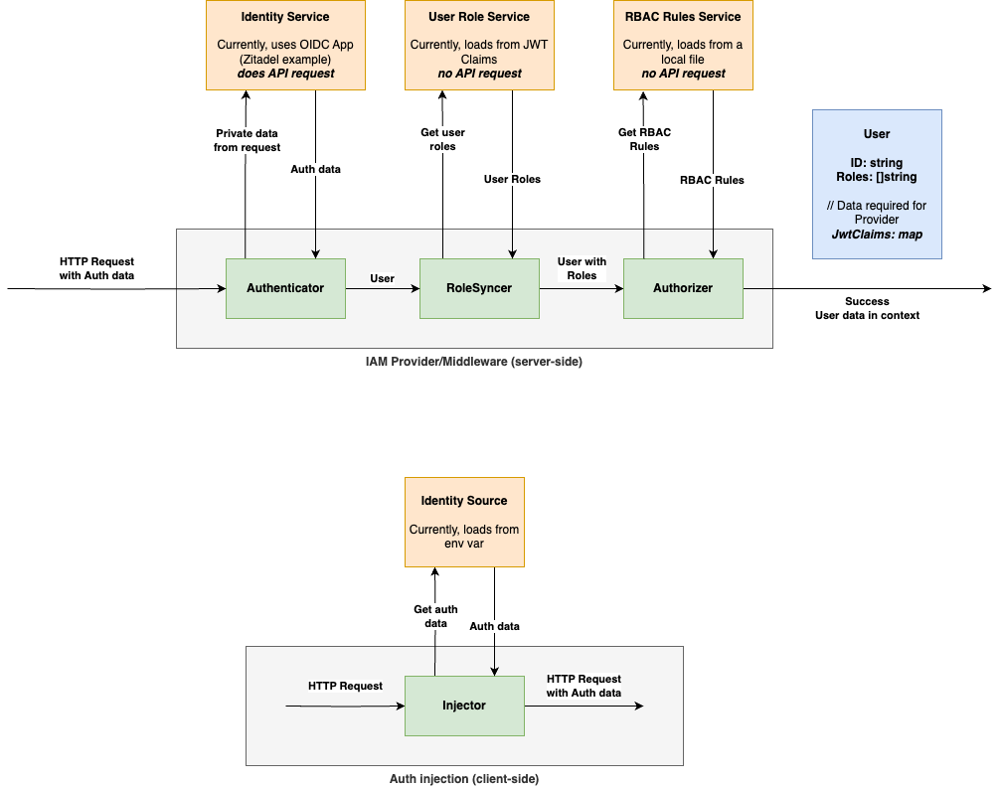

## IAM Service

### High level architecture


#### Server-side stack
- **Authenticate** - Interacts with IDP to authenticate request and obtain user identity data. 
Part of API middleware.
- **RoleSyncer** - Interacts with some kind of store (e.g. database or from JWT token claim) to fetch and sync user role data. 
Part of API middleware.
- **Authorizer** - Decides if a User can perform a given action on an asset based on provided rules. 
Separate component that is used to check user-action permissions. 
Used in API middleware for API asset-action (e.g. `api:put`) authorization.

#### Client-side stack
- **AuthInjector** - Injects data into requests from different sources (e.g. from env).

### Test environment
Requires Docker to run. This will create a Zitadel instance with bootstrapped data which you can use
out-of-the-box to enable IAM for VMClarity.

```bash
# Create Zitadel
cd pkg/backend/iam/testdata/zitadel
chmod +x ./create-zitadel
RECREATE=true ./create-zitadel

# Get autogenerated file and obtain VMClarity config data.
# Update if required.
cat bootstrap/generated/vmclarity-data.env
```

### Config parameters
```
# IAM global config
IAM_ENABLED=true

# Authentication config
AUTH_OIDC_ISSUER=http://localhost:8080
AUTH_OIDC_CLIENT_ID=app_client_id
AUTH_OIDC_CLIENT_SECRET=app_client_secret

# RoleSynchronization config
ROLESYNCER_JWT_ROLE_CLAIM=roles-claim-key

# Authorization config
AUTHZ_LOCAL_RBAC_RULE_FILEPATH=path-to/rbac_rule_policy_example.csv

# AuthInjection - Client service account
APISERVER_BEARER_TOKEN_ENV_VAR=APISERVER_BEARER_TOKEN
APISERVER_BEARER_TOKEN=Service Account PAM
```

### TODO
- [ ] Add support for different Identity Providers (IDPs) to avoid relying on Zitadel.
- [ ] Add Authorizer that uses database as Role permission source. Also add bootstrapping for the role data.
- [ ] Add support for Authenticator to load auth data from different parts of request (e.g. cookies).
- [ ] Add AuthInjectors that enable injecting data into different parts of request (e.g. cookies)
- [ ] Add AuthInjectors that enable injection from different sources (e.g. from file)
- [ ] Handle http response codes properly (currently only 403 is returned on Auth/Z failure)
- [ ] Add tests

### More resources
- **Zitadel** - used to create OIDP app and auth roles via JWT token claims - https://zitadel.com/
- **Casbin** - used to validate roles against defined role policies - https://casbin.org/
- **Casbin** Adapters - to extend role rule data synchronization - https://casbin.org/docs/adapters
